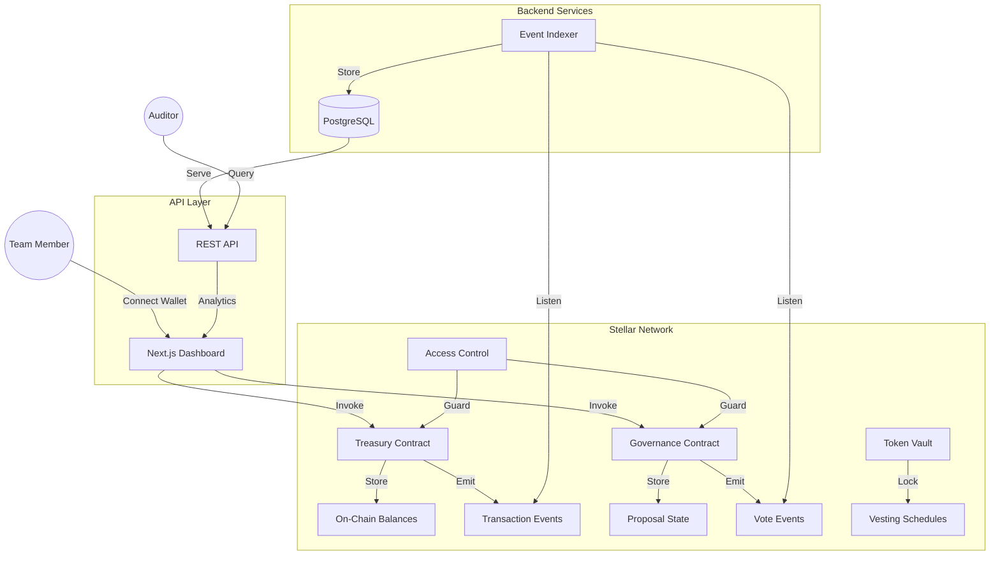

# StellarGuard

A decentralized multi-signature treasury and DAO governance platform built on Stellar Soroban.

```
  ____  _       _ _            ____                     _
 / ___|| |_ ___| | | __ _ _ __/ ___|_   _  __ _ _ __ __| |
 \___ \| __/ _ \ | |/ _` | '__| |  _| | | |/ _` | '__/ _` |
  ___) | ||  __/ | | (_| | |  | |_| | |_| | (_| | | | (_| |
 |____/ \__\___|_|_|\__,_|_|   \____|\__,_|\__,_|_|  \__,_|
```

> Trustless treasury management for teams, DAOs, and community organizations.

---

## 💡 The Idea

StellarGuard is a **sovereign, on-chain treasury management protocol** that enables:

- **Multi-Sig Fund Management**: Configurable approval thresholds for withdrawals (e.g., 3-of-5 signers)
- **DAO Governance**: Create and vote on proposals for fund allocation, policy changes, and membership
- **Token Vesting**: Lock tokens with time-based release schedules for team allocations
- **Role-Based Access**: Owner, Admin, Member, and Viewer permission tiers
- **Full Transparency**: Every action is recorded on-chain with event emissions

### Why This Matters

Many cooperatives, savings groups (ajo/esusu), and community organizations in emerging markets lack transparent treasury tools. StellarGuard provides trustless, on-chain fund management with Stellar's low fees and fast finality — no bank account required.

---

## 🏗️ Architecture



---

## 🛠 Tech Stack

| Layer | Technology |
|-------|-----------|
| **Smart Contracts** | Soroban (Rust), `soroban-sdk` |
| **Frontend** | Next.js 14, TypeScript, Tailwind CSS |
| **Wallet** | Freighter Browser Extension |
| **Backend** | FastAPI (Python) or NestJS (TypeScript) |
| **Database** | PostgreSQL, Redis |
| **Indexing** | Custom Soroban-RPC event listener |
| **DevOps** | GitHub Actions, Docker Compose |

---

## 📦 Project Structure

```
stellar/
├── smartcontract/           # Soroban smart contracts (Rust)
│   ├── Cargo.toml           # Workspace root
│   └── contracts/
│       ├── treasury/        # Multi-sig treasury
│       ├── governance/      # Proposal & voting
│       ├── token-vault/     # Token locking & vesting
│       └── access-control/  # Role-based permissions
├── frontend/                # Next.js dashboard
│   └── src/
│       ├── app/             # Pages & routes
│       ├── components/      # UI components
│       ├── context/         # Wallet provider
│       ├── hooks/           # Data fetching hooks
│       └── lib/             # Soroban helpers
├── docs/                    # Issue trackers & guides
├── README.md
├── CONTRIBUTING.md
├── CODE_OF_CONDUCT.md
├── STYLE.md
└── MAINTAINERS.md
```

---

## 🚀 Getting Started

### 1. Prerequisites

| Tool | Version | Notes |
|------|---------|-------|
| **Node.js** | 20+ | Use [nvm](https://github.com/nvm-sh/nvm) to manage versions |
| **Rust & Cargo** | stable | `curl --proto '=https' --tlsv1.2 -sSf https://sh.rustup.rs \| sh` |
| **Soroban CLI** | latest | `cargo install --locked soroban-cli` |
| **Docker & Docker Compose** | 24+ | Required to run the full local stack |
| **Freighter Wallet** | latest | Browser extension for Stellar transactions |

### 2. Quick Start

**Clone the repository:**

```bash
git clone https://github.com/YourOrg/StellarGuard.git
cd StellarGuard
```

**Option A — Docker (recommended, runs everything):**

```bash
cp .env.docker .env          # copy default environment config
docker compose up --build    # starts frontend, backend, postgres, redis, indexer
```

- Frontend: http://localhost:3000
- Backend API: http://localhost:3001/api
- API Docs (Swagger): http://localhost:3001/api/docs

**Option B — Manual setup:**

*Smart contracts:*

```bash
cd smartcontract
cargo build --all            # verify Rust/Soroban toolchain
cargo test --all             # run unit tests
```

*Frontend:*

```bash
cd frontend
npm install
cp .env.local.example .env.local   # configure RPC URL and network
npm run dev                        # starts on http://localhost:3000
```

*Backend API & indexer:*

```bash
cd backend
npm install
cp .env.example .env               # configure DATABASE_URL and RPC endpoint
npm run dev                        # starts API on http://localhost:3001
```

---

## 🚀 Deploying Contracts

### Prerequisites

| Tool | Install |
|------|---------|
| **Stellar CLI** | `cargo install --locked stellar-cli` |
| **Rust + wasm32 target** | `rustup target add wasm32-unknown-unknown` |

### One-command Testnet Deploy

```bash
# Set your deployer identity (Stellar secret key or CLI identity name)
export DEPLOY_SOURCE=my-deployer-identity

# Run the deploy script
./scripts/deploy.sh --network testnet --source "$DEPLOY_SOURCE"
```

The script will:
1. Build all four contracts with `stellar contract build` (release WASM)
2. Deploy each contract to the specified network
3. Write contract IDs to `scripts/deployed-contracts.json`
4. Print a summary of all deployed contract addresses

### Copy Contract IDs to Frontend

After deployment, copy the printed IDs into `frontend/.env.local`:

```env
NEXT_PUBLIC_TREASURY_CONTRACT_ID=<treasury-id-from-deployed-contracts.json>
NEXT_PUBLIC_GOVERNANCE_CONTRACT_ID=<governance-id>
NEXT_PUBLIC_VAULT_CONTRACT_ID=<token_vault-id>
NEXT_PUBLIC_ACL_CONTRACT_ID=<access_control-id>
```

### Automated Deployment via GitHub Actions

Push a version tag to trigger the [deploy workflow](.github/workflows/deploy.yml):

```bash
git tag v1.0.0
git push origin v1.0.0
```

The workflow installs the Stellar CLI, builds contracts, deploys to testnet, uploads `deployed-contracts.json` as a build artifact, and commits the updated file back to `main`.

**Required secret:** `STELLAR_DEPLOY_SECRET_KEY` — set this in your repository's Settings → Secrets.

---

## 📚 Documentation & Trackers

We have separated our task lists for better organization. Please refer to the specific tracker for your area of contribution:

- 🧠 [Smart Contract Issues](docs/ISSUES-SMARTCONTRACT.md) — 25 issues
- 🎨 [Frontend Issues](docs/ISSUES-FRONTEND.md) — 25 issues
- ⚙️ [Backend & Indexer Issues](docs/ISSUES-BACKEND.md) — 12 issues
- 🔧 [DevOps Issues](docs/ISSUES-DEVOPS.md) — 8 issues

**Guides:**

- 📘 [Smart Contract Guide](docs/SMARTCONTRACT_GUIDE.md)
- 🌐 [Frontend Integration Guide](docs/FRONTEND_GUIDE.md)

**Architecture Decisions:**

- 🗂️ [ADR-001: Freighter Wallet Integration](docs/adr/001-wallet-integration.md)
- 🗂️ [ADR-002: Data Loading & Request Guards](docs/adr/002-data-loading.md)
- 🗂️ [ADR-003: Transaction Pipeline](docs/adr/003-transaction-pipeline.md)
- 🗂️ [ADR-004: NestJS Backend Choice](docs/adr/004-nestjs-backend.md)

---

## 🤝 Contributing

We welcome contributions! Please see our [CONTRIBUTING.md](CONTRIBUTING.md) for details on our code of conduct and the development process.

**Quick Start for Contributors:**

1. Pick an issue from `docs/ISSUES-*.md`.
2. Fork the repo and create a branch: `feat/<issue-id>-<description>` (e.g. `feat/BE-1-api-scaffold`).
3. Make your changes, run tests, and update the checkbox in the relevant `docs/ISSUES-*.md`.
4. Open a PR against `main` — see [CONTRIBUTING.md](CONTRIBUTING.md) for the full workflow.

---

## 📄 License

This project is licensed under the MIT License — see the [LICENSE](LICENSE) file for details.
