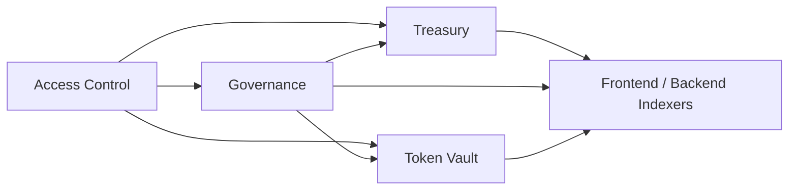

# StellarGuard Smart Contract Guide

This guide documents the Soroban contracts in `smartcontract/contracts`, the data each one stores, the public methods they expose, the events they emit, and the standard local workflow for building, testing, and deploying them.

## Contract Architecture



- `access-control` manages roles and permission checks that other modules can rely on.
- `governance` manages proposal creation, voting, quorum, finalization, and proposal execution.
- `treasury` manages native balance, token deposits, and multisig withdrawal approvals.
- `token-vault` manages time locks, vesting schedules, and emergency unlock approvals.

## Treasury Contract

Location: `smartcontract/contracts/treasury`

Purpose:

- Hold treasury balances.
- Accept native and token deposits.
- Enforce signer-based approval thresholds for withdrawals.

State schema:

- `Admin`: treasury administrator.
- `Threshold`: minimum approvals required for execution.
- `Signers`: signer set allowed to propose, approve, and execute.
- `Balance`: native treasury balance.
- `Transaction(u64)`: stored withdrawal proposal.
- `TxCounter`: monotonically increasing proposal id.
- `Initialized`: initialization guard.
- `TokenBalance(Address, Address)`: per depositor and per token deposit balance.

Core structs:

- `Transaction`: withdrawal destination, amount, memo, approval list, execution flag, proposer, timestamp.
- `TreasuryConfig`: admin, threshold, signer count, native balance, transaction count.

Public API:

- `initialize(admin, threshold, signers)`
- `deposit(from, amount)`
- `deposit_token(from, token_address, amount)`
- `propose_withdrawal(proposer, to, amount, memo)`
- `approve(signer, tx_id)`
- `execute(executor, tx_id)`
- `add_signer(admin, new_signer)`
- `remove_signer(admin, signer)`
- `set_threshold(admin, new_threshold)`
- `get_balance()`
- `get_token_balance(depositor, token_address)`
- `get_config()`
- `get_transaction(tx_id)`
- `get_signers()`
- `transfer_admin(current_admin, new_admin)`
- `upgrade(admin, new_wasm_hash)`

Events:

- `(treasury, init)` schema: `(admin: Address, threshold: u32, signer_count: u32)`; example: `(admin_address, 2_u32, 3_u32)`
- `(treasury, deposit)` schema: `(from: Address, amount: i128, new_balance: i128)`; example: `(depositor_address, 1_000_000_i128, 1_000_000_i128)`
- `(treasury, dep_tok)` schema: `(from: Address, token_address: Address, amount: i128, new_token_balance: i128)`; example: `(depositor_address, token_contract, 500_i128, 1_500_i128)`
- `(treasury, propose)` schema: `(tx_id: u64, proposer: Address, to: Address, amount: i128)`; example: `(1_u64, proposer_address, recipient_address, 3_000_000_i128)`
- `(treasury, approve)` schema: `(tx_id: u64, signer: Address, approval_count: u32)`; example: `(1_u64, signer_address, 2_u32)`
- `(treasury, execute)` schema: `(tx_id: u64, to: Address, amount: i128, remaining_balance: i128)`; example: `(1_u64, recipient_address, 3_000_000_i128, 5_000_000_i128)`
- `(treasury, add_sig)` schema: `(new_signer: Address, signer_count: u32)`; example: `(new_signer_address, 4_u32)`
- `(treasury, rem_sig)` schema: `(removed_signer: Address, signer_count: u32)`; example: `(removed_signer_address, 2_u32)`
- `(treasury, thresh)` schema: `(old_threshold: u32, new_threshold: u32)`; example: `(2_u32, 3_u32)`
- `(treasury, admin)` schema: `(old_admin: Address, new_admin: Address)`; example: `(old_admin, new_admin)`

### Deposit flow

`deposit(from, amount)` is **not** a bookkeeping-only call. The contract
performs an on-chain SEP-41 transfer from the depositor into itself before
updating its stored balance:

1. The contract enforces that it is initialized and that `amount > 0`.
2. `from.require_auth()` fires, so the depositor must sign the invocation
   (or, in tests, be mocked via `mock_all_auths()`).
3. The contract loads the configured `Asset` (the SAC/SEP-41 contract that
   was passed to `initialize`) and constructs a `token::TokenClient`.
4. `token_client.transfer(&from, &env.current_contract_address(), &amount)`
   moves the funds on-chain. If the depositor lacks the balance the SAC
   contract panics and the deposit is reverted atomically — no partial
   bookkeeping is written.
5. Only after the transfer succeeds does the contract increment
   `DataKey::Balance` and emit `(treasury, deposit)`.

`deposit_token(from, token_address, amount)` follows the same pattern but
targets an arbitrary SEP-41 token contract and persists balances under the
per-`(depositor, token)` key `DataKey::TokenBalance`.

The asymmetry with `propose_withdrawal` / `execute` is deliberate:
withdrawals require multisig approval before the same `token_client.transfer`
is invoked from the contract address to the recipient.

## Governance Contract

Location: `smartcontract/contracts/governance`

Purpose:

- Let members create proposals.
- Record votes during a fixed ledger-based voting window.
- Finalize proposals using quorum and majority rules.
- Execute passed proposals.

State schema:

- `Admin`: governance admin.
- `Initialized`: initialization guard.
- `Members`: voter/member list.
- `QuorumPercent`: quorum percentage used during finalization.
- `VotingPeriod`: voting duration in ledger sequence numbers.
- `ProposalCounter`: monotonically increasing proposal id.
- `Proposal(u64)`: proposal record.
- `Vote(u64, Address)`: per-proposal vote marker to block double voting.

Core structs and enums:

- `ProposalAction`: `Funding`, `PolicyChange`, `AddMember`, `RemoveMember`, `General`.
- `ProposalStatus`: `Active`, `Passed`, `Rejected`, `Executed`, `Expired`.
- `Proposal`: proposal metadata, vote totals, action, amount, target, and timing.
- `GovConfig`: admin, member count, quorum percent, voting period, proposal count.

Public API:

- `initialize(admin, members, quorum_percent, voting_period)`
- `create_proposal(proposer, title, description, action, amount, target)`
- `vote(voter, proposal_id, vote_for)`
- `finalize(caller, proposal_id)`
- `execute_proposal(executor, proposal_id)`
- `get_proposal(proposal_id)`
- `get_config()`
- `get_members()`
- `has_voted(proposal_id, voter)`
- `transfer_admin(current_admin, new_admin)`
- `set_quorum(admin, new_quorum)`
- `set_voting_period(admin, new_period)`
- `upgrade(admin, new_wasm_hash)`

Finalization logic:

- Voting must be over: `current_ledger > ends_at`.
- Quorum is calculated as `(member_count * quorum_percent) / 100`.
- If `total_votes < quorum`, status becomes `Expired`.
- If quorum is met and `votes_for > votes_against`, status becomes `Passed`.
- Otherwise status becomes `Rejected`.

Execution note:

- `AddMember` proposal execution now returns `Error::MemberAlreadyExists` when the
  target is already in `Members`; this intentionally prevents silent no-op
  executions.

Events:

- `(gov, init)` schema: `(admin: Address, member_count: u32, quorum_percent: u32)`; example: `(admin_address, 3_u32, 50_u32)`
- `(gov, propose)` schema: `(proposal_id: u64, proposer: Address, ends_at: u32, target: Address, amount: i128)`; example: `(1_u64, proposer_address, ends_at_ledger, target_address, 0_i128)`
- `(gov, vote)` schema: `(proposal_id: u64, voter: Address, vote_for: bool)`; example: `(1_u64, voter_address, true)`
- `(gov, finalize)` schema: `(proposal_id: u64, status: ProposalStatus)`; example: `(1_u64, ProposalStatus::Passed)`
- `(gov, exec)` schema: `(proposal_id: u64, executor: Address)`; example: `(1_u64, executor_address)`
- `(gov, admin)` schema: `(old_admin: Address, new_admin: Address)`; example: `(old_admin, new_admin)`
- `(gov, quorum)` schema: `(new_quorum_percent: u32)`; example: `(66_u32)`

## Token Vault Contract

Location: `smartcontract/contracts/token-vault`

Purpose:

- Lock tokens until a future timestamp.
- Create vesting schedules with cliffs and linear release.
- Require multiple emergency signers for emergency unlock.

State schema:

- `Admin`: vault admin.
- `Initialized`: initialization guard.
- `EmergencySigners`: addresses allowed to approve emergency unlocks.
- `EmergencyThreshold`: number of approvals required.
- `LockCounter`: monotonically increasing lock id.
- `Lock(u64)`: stored lock record.
- `EmergencyApprovals(u64)`: collected approvers for a lock.
- `VestingCounter`: monotonically increasing vesting id.
- `Vesting(u64)`: stored vesting schedule.
- `TotalLocked`: aggregate locked or unclaimed amount.

Core structs:

- `TokenLock`: owner, amount, created time, unlock time, claimed state, memo.
- `VestingSchedule`: beneficiary, total amount, claimed amount, start time, duration, cliff, memo.
- `VaultStats`: total locked, lock count, vesting count, admin.

Public API:

- `initialize(admin, emergency_signers, emergency_threshold)`
- `lock_tokens(owner, amount, duration, memo)`
- `claim(owner, lock_id)`
- `approve_emergency(signer, lock_id)`
- `emergency_unlock(caller, lock_id)`
- `create_vesting(admin, beneficiary, total_amount, duration, cliff, memo)`
- `claim_vested(beneficiary, vesting_id)`
- `get_lock(lock_id)`
- `get_vesting(vesting_id)`
- `get_locks_by_owner(owner, start_after_id, limit)`
- `get_vestings_by_beneficiary(beneficiary, start_after_id, limit)`
- `get_stats()`
- `transfer_admin(current_admin, new_admin)`
- `upgrade(admin, new_wasm_hash)`

Events:

- `(vault, init)` schema: `(admin: Address, emergency_signer_count: u32)`; example: `(admin_address, 2_u32)`
- `(vault, lock)` schema: `(lock_id: u64, owner: Address, amount: i128, duration: u64)`; example: `(1_u64, owner_address, 400_000_i128, 120_u64)`
- `(vault, claim)` schema: `(lock_id: u64, owner: Address, amount: i128)`; example: `(1_u64, owner_address, 400_000_i128)`
- `(vault, vest)` schema: `(vesting_id: u64, beneficiary: Address, total_amount: i128, duration: u64)`; example: `(1_u64, beneficiary_address, 900_000_i128, 90_u64)`
- `(vault, v_claim)` schema: `(vesting_id: u64, beneficiary: Address, claimable_amount: i128)`; example: `(1_u64, beneficiary_address, 450_000_i128)`
- `(vault, emrg_ap)` schema: `(lock_id: u64, signer: Address, approval_count: u32)`; example: `(1_u64, signer_address, 2_u32)`
- `(vault, emrg_ex)` schema: `(lock_id: u64, caller: Address, amount: i128)`; example: `(1_u64, caller_address, 700_000_i128)`
- `(vault, admin)` schema: `(old_admin: Address, new_admin: Address)`; example: `(old_admin, new_admin)`

## Backend Event Parser Mapping

Location: `backend/src/parser.ts`

The backend event parser maps `(topic1, topic2)` to human-readable names via the
`EVENT_NAMES` dictionary:

- Treasury mappings:
  - `deposit` -> `Treasury Deposit`
  - `propose` -> `Treasury Propose`
  - `approve` -> `Treasury Approve`
  - `execute` -> `Treasury Execute`
  - `init` -> `Treasury Initialize`
  - `dep_tok` -> `Treasury Deposit Token`
  - `add_sig` -> `Treasury Add Signer`
  - `rem_sig` -> `Treasury Remove Signer`
  - `thresh` -> `Treasury Threshold Change`
  - `admin` -> `Treasury Admin Change`
- Governance mappings:
  - `propose` -> `Governance Propose`
  - `vote` -> `Governance Vote`
  - `finalize` -> `Governance Finalize`
  - `exec` -> `Governance Execute`
  - `init` -> `Governance Initialize`
  - `admin` -> `Governance Admin Change`
  - `quorum` -> `Governance Quorum Change`
- Vault mappings:
  - `lock` -> `Vault Lock`
  - `claim` -> `Vault Claim`
  - `vest` -> `Vault Vest`
  - `v_claim` -> `Vault Vesting Claim`

If a pair is not found, the parser stores `eventName: null` while still
returning decoded topic/data payloads for downstream handling.

## Access Control Contract

Location: `smartcontract/contracts/access-control`

Purpose:

- Store the role hierarchy used across the system.
- Support ownership transfer and permission queries.

State schema:

- `Initialized`: initialization guard.
- `Owner`: contract owner.
- `Role(Address)`: stored `RoleAssignment` for an address.
- `AllMembers`: address list for all assigned roles.
- `RoleCount(u32)`: count of addresses per role level.

Core structs and enums:

- `Role`: `Viewer`, `Member`, `Admin`, `Owner`.
- `RoleAssignment`: address, role, assignment time, assignor.
- `AccessSummary`: owner plus counts of each role class.

Public API:

- `initialize(owner)`
- `assign_role(assignor, target, role)`
- `revoke_role(revoker, target)`
- `has_permission(address, required_role)`
- `is_owner(address)`
- `is_admin_or_above(address)`
- `is_member_or_above(address)`
- `get_role(address)`
- `get_all_members()`
- `get_summary()`
- `transfer_ownership(current_owner, new_owner)`
- `upgrade(owner, new_wasm_hash)`

Events:

- `(acl, init)` payload example: `owner_address`
- `(acl, assign)` payload example: `(target_address, Role::Member, assignor_address)`
- `(acl, revoke)` payload example: `(target_address, revoker_address)`
- `(acl, owner)` payload example: `(old_owner, new_owner)`

## Local Development Setup

Prerequisites:

- Rust toolchain via [rustup](https://rustup.rs/)
- `wasm32-unknown-unknown` target
- Soroban CLI

Recommended setup:

```bash
rustup target add wasm32-unknown-unknown
cargo install soroban-cli
cd smartcontract
cargo build --workspace
```

## Testing Guide

Run the full contract suite:

```bash
cd smartcontract
cargo test --workspace
```

Run one contract at a time:

```bash
cargo test -p stellar-guard-treasury
cargo test -p stellar-guard-governance
cargo test -p stellar-guard-token-vault
cargo test -p stellar-guard-access-control
```

The workflow tests cover:

- Treasury: initialize -> deposit -> propose -> approve -> execute
- Governance: initialize -> propose -> vote -> finalize -> execute
- Token vault lock flow: lock -> wait -> claim
- Token vault vesting flow: create -> cliff -> partial claim -> full claim
- Emergency unlock flow: approvals -> threshold reached -> unlock

## Deployment Instructions

Build optimized WASM:

```bash
cd smartcontract
soroban contract build
```

Deploy a contract to testnet:

```bash
soroban keys generate deployer --network testnet
soroban keys fund deployer --network testnet

soroban contract deploy \
  --wasm target/wasm32-unknown-unknown/release/stellar_guard_governance.wasm \
  --source deployer \
  --network testnet
```

Repeat the deploy step for:

- `stellar_guard_treasury.wasm`
- `stellar_guard_governance.wasm`
- `stellar_guard_token_vault.wasm`
- `stellar_guard_access_control.wasm`

Post-deployment checklist:

- Save each returned contract id.
- Initialize each contract with production admin and signer/member addresses.
- Update frontend and backend configuration with deployed ids and RPC settings.
